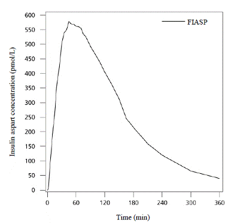
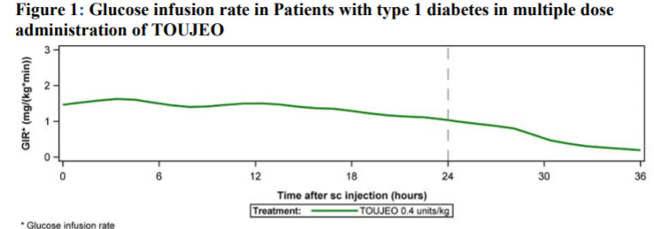

# DiaML

## Úvod

Dáta nad kterýma budeme stavět model jsou záznamy o průběhu nemoci [Diabetes 
Melitus typu 1](https://en.wikipedia.org/wiki/Type_1_diabetes). Jedná se 
o autoimunitní ochorení, kterého důsledkem je neschopnost produkce inzulinu.
Inzulin je hormon, kterého hlavní funkce spočívá v regulaci hladiny glukózy (jednoduchý sacharid) v těle. 

Pacienti s diabetem typu 1 si inzulin musí podávat tzv. inzulínovými perami nebo 
inzulinovými pumpami a dávkovat inzulin podle příjmu sacharidů. Cílem je inzulin
udržet v zdravém rozmezí a vyhnout se příliš nízkym, nebo vysokým hladinám.

### Model
Velmi zjednodušeně bychom mohli říct, že na hladinu glukózy působí faktory
dvěma způsoby, buď hladinu glukozy zvyšují, nebo znižují.

Hlavní faktor který zvyšuje hladinu glukozy jsou konzumované sacharidy. Ne každý
typ sacharidu se ale chová stejně. Konzumované sacharidy prvně musí být stráveny a
rozloženy na glukózu, délka tohoto procesu se liší v závislosti na glykemickém indexu:

Další faktory zvyšující glukozu jsou: stres, anaerobní cvičení, v důsledku působení
glykagenu (hormon, který stimuluje uvolnění glukozy uložené v játrech a tím zvyšuje
koncentrace glukozy v krvi), a jiné.

Hlavní faktor snižující hladinu glukozy je inzulín. Inzulín podávaný inzulinovými
perami je obecně v 2 podobách: rychle a pomalu působící. Níže vidíme grafy zobrazující
působení podaného inzulinu v čase, pro 2 inzuliny které používám Fiasp (rychlý) a
Toujeo (pomalý):

Další faktory snižující hladinu glukozy jsou: aerobní cvičení, alkohol, a jiné.

### Zdroje dat
- Data ze senzoru, který poskytuje kontinuální přehled o hladině glukozy v krvi
- Ručně zadané data o příjmu sacharidů v gramech
- Ručně zadané data o dávce podaného inzulinu
- Data z chytrých hodinek: Kroky, ušlá vzdálenost, tep, a jiné
- Dodatečné příznaky jako glykemické index snězeného jídla a informace o 
požití alkoholu

### Cíle
Cílem je nad datami sestavit model, který by umožnil dělat predikce hladiny glukózy
v čase. Např. hladiná glukozy o 1h nebo o 2h. Tato predikce by mohla vzít do úvahy objem
sacharidů, které se člověk s diab. typu 1 chystá skonzumovat a/nebo dávku inzulinu, kterou
si chystá píchnout. Model by tak efektivně mohl doporučovat dávku inzulinu nebo
porci sacharidů, tak aby glukoza zůstala v cílovém (zdravém) rozmezí.
